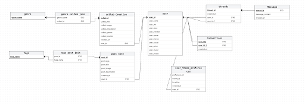

# LineUp - Mojah Web Consulting

## Om projektet

Mojah Web Consulting er et nystartet web-bureau, der udvikler en web-baseret MVP for **LineUp** – en social media platform for musikere, producere og andre aktører i den nordiske musikindustri. Platformen skal gøre det lettere at finde samarbejdspartnere, netværke og vokse i et troværdigt, transparent miljø.

- [Link til GitHub Issues](https://github.com/orgs/eaaa-dob-wu-e25a/projects/16)
- [Link til GitHub Pull Request Closed](https://github.com/eaaa-dob-wu-e25a/sem-proj-mojah-web-consulting/pulls?q=is%3Apr+is%3Aclosed)

## Deployed løsning

- [**Frontend**](https://sem-proj-mojah-web-consulting-frontend.onrender.com/)
- [**Backend**](https://sem-proj-mojah-web-consulting-backend.onrender.com)

### Testbruger
- **Email:** games@designbyjimmi.com
- **Password:** 12345678

*Du kan også oprette din egen bruger via registreringssiden.*

Arkitekturen er opbygget som en hybrid client-server model og organiseret som et
monorepo, hvor både frontend og backend ligger i samme repository. Frontend
kommunikerer både direkte med Supabase (authentication og database) og med et
REST-baseret backend API bygget i Node.js og Express til udvalgte funktioner.

## Tech Stack

### Frontend
- **React Router 7** - Framework med SSR og HMR
- **React 19** - UI bibliotek
- **TypeScript** - Type safety
- **Tailwind CSS** - Styling
- **Vite** - Build tool
- **Supabase** - Authentication og data
- **Axios** - HTTP requests

### Backend
- **Node.js + Express** – Supplerende REST API
- **Supabase (PostgreSQL)** – Database, authentication og storage
- **Supabase Auth (JWT)** – Token-baseret authentication
- **Express middleware** – Server-side token-validering
- **Multer** – File uploads

## Database

Databasen er hostet på Supabase PostgreSQL og indeholder følgende hovedtabeller:

- **profiles** - Brugerprofiler med musik info, interesser og location
- **connections** - Netværksforbindelser mellem brugere
- **messages** - Chat beskeder mellem brugere
- **threads** - Chat tråde (1-til-1 og gruppe)
- **posts** - Brugerindhold (noter, stories, requests)
- **collabs** - Samarbejder mellem musikere
- **genres** - Musik genrer
- **tags** - Tags til posts og profiler

**Database Schema fra Supabase**

**ER Diagram**

## Backend

Backend API'et er bygget med **Node.js** og **Express** og håndterer:

- **Authentication** - Supabase Auth med server-side JWT-validering
- **User management** - Brugerprofiler, connections og Follow/Unfollow via `/api/profiles/*` og `/api/connections/*` - Lavet af Omar Gaal
- **Posts & Content** - CRUD operationer for posts via `/api/posts/*` - Lavet af Mikkel Ruby
- **Collaborations** - Håndtering af samarbejder mellem musikere via `/api/collaborations/*` - Lavet af Anders Flæng
- **Chat** - Beskeder og tråde (1-til-1 og gruppechats) via `/api/messages/*` og `/api/threads/*` - Lavet af Jimmi Larsen
- **File uploads** - Håndtering af profil billeder og medie uploads via Multer på `/api/uploads/*` - Var importeret af Mikkel Ruby
- **Genres & Tags** - Metadata for musikgenrer og tags via `/api/genres/*` og `/api/tags/*` - Lavet af Omar Gaal & Anders Flæng

API'et følger REST principper og leverer JSON responses med JWT-baseret authorization.

## Frontend

Frontend applikationen er bygget som en **Single Page Application (SPA)** med React Router 7 og understøtter:

- **Server-Side Rendering (SSR)** - Hurtigere initial load og bedre SEO
- **Type-safe udvikling** - TypeScript for færre bugs og bedre developer experience
- **Moderne styling** - Tailwind CSS utility-first approach

### Hovedfunktioner:
- **Onboarding & Auth** - Get started flow, login og registrering - Lavet af Jimmi Larsen
- **Brugerprofil** - Visning og redigering af profil med musikinfo, genrer, og sociale links - Lavet af Omar Gaal & Hani Zaghmout
- **Feed & Posts** - Oversigt over indhold fra netværk - Lavet af Mikkel Ruby
- **Content Creation** - Opret collaboration requests - Lavet af Mikkel Ruby
- **Collaborations** - Oversigt og håndtering af samarbejder - Lavet af Anders Flæng
- **Chat** - 1-til-1 og gruppe chat funktionalitet (gruppechat data er pt. statisk) - Lavet af Jimmi Larsen

### Layouts:
- **PublicLayout** - Offentlige sider (login, register, get started) - Alle var med
- **ProtectedLayout** - Beskyttede sider der kræver login - Alle var med
- **Root Layout** - Hovedlayout med navigation og header - Sat op af Mikkel Ruby

## Funktioner vi gerne ville have haft lavet

Følgende features var planlagt, men nåede ikke at blive implementeret grundet tidsrammen:

- **Avanceret søgning & filtrering** - Søgning med filtre på genrer, location, instrumenter og erfaring
- **Notifikationssystem** - Notifikationer for nye beskeder, connection requests og samarbejder
- **Audio/Video uploads** - Upload af lydklip og videoer til profil og posts
- **Real-time chat** - WebSocket-baseret chat for instant messaging (nuværende løsning kræver page refresh)
- **Performance optimering** - Bedre caching, lazy loading og code splitting
- **Search & Discovery** - Find musikere og producere

## Ekstra features / innovation ud over kravene

I udviklingen af LineUp har vi taget højde for følgende aspekter, disse kan være ændringer som vi har lavet i forhold til figma filen:

- **Feedback** - Der var ikke taget højde for feedback under login, register
- **RememberMe** - Denne feature er lavet da det er quality of life.
- **Friends** - På designet er der en række brugere i toppen. Vi har valgt at lave det til en venne chat funktion i stil af det man finder på Messenger.
- **Gruppechat** - Vi har implementeret gruppechat funktionalitet med mulighed for at skifte navn og uploade gruppebillede, selvom data pt. er statisk. Brugere kan invitere andre til gruppen. En gruppechat dukker først op når man bruger add to conversation.
Denne funktion blev lavet fordi der i chat sekmentet i figma designet var makeret en groups chat-tab. Den var altså ikke en del af designet.
- **Collabs** - Gruppen to en beslutning efter at have kigget på designet at skære services fra 

## Projektstyring og arbejdsmetode

- **Facebook Messenger** Vi brugte Facebook Messenger som vores primær kommunikationsmetode når vi arbejde der hjemme, her har vi aftalt mødetider, og udeligeret opgaver. Vi har også brugt det til Feedback
- **Github** Vi brugte Github' Projektstyrings værktøj (Kanban Board) til at holde os opdateret på hvad der skulle være i projektet og hvor langt vi var i projektet, Vi har også brugt Github Pull Requests
- **Branching** I GitHub brugte vi også en opsætning hvor vi oprettede en "dev" branch. Tanken her var at man så brancher ud fra den når vi oprettede en ny Feature i GitHub. Dette gjorde at vi havde et testmiljø der ikke var offentligt.

[Link til et eksempel på Pull Request](https://github.com/eaaa-dob-wu-e25a/sem-proj-mojah-web-consulting/pull/66)
[Link til et eksempel på Projekt](https://github.com/eaaa-dob-wu-e25a/sem-proj-mojah-web-consulting/issues/58)

##Post-mortem##

**Hvad vi godt kunne lide**
- Gruppen var generelt glade for den måde vi kørte branches på (via en dev branch som man så brancher ud fra)
- Der var plads til at lærer i gruppen

**Hvad gruppen kunne have gjort anderledes**
- Gruppen fik ikke brugt Git Code Review så meget
- Gruppen fik ikke sat projektet rigtig op til at starte med hvilket gav merge konflikt.
